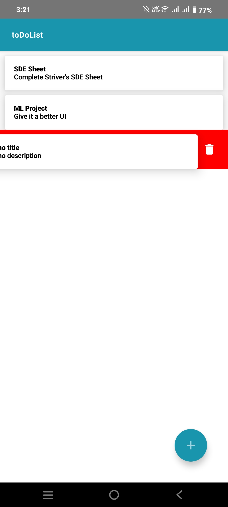

# toDoList App

## Overview

This is a simple To-Do List Android application built using Jetpack Compose and Kotlin. The app allows users to create, update, view, and delete tasks. The app architecture is based on MVVM (Model-View-ViewModel) and utilizes Room for data persistence.

## Features

- **Add Task**: Users can add a new task with a title and description.
- **View Tasks**: All tasks are displayed in a list on the home screen.
- **Update Task**: Users can update the details of an existing task.
- **Delete Task**: Tasks can be deleted by swiping left or right on a task item.
- **Persist Data**: All tasks are stored locally using the Room persistence library.

## Screenshots

Here are some screenshots of the app:





## Room Database

The app uses Room for local data storage. The `TaskDao` interface defines the following methods:
- **`addTask(task: Task)`**: Inserts a new task into the database.
- **`getAllTasks()`**: Returns a `Flow` of a list of all tasks.
- **`updateATask(task: Task)`**: Updates an existing task in the database.
- **`deleteATask(task: Task)`**: Deletes a task from the database.
- **`getATaskById(id: Long)`**: Retrieves a task by its ID.

## Installation

1. Clone the repository:
   ```bash
   git clone https://github.com/yourusername/todo-list-app.git
